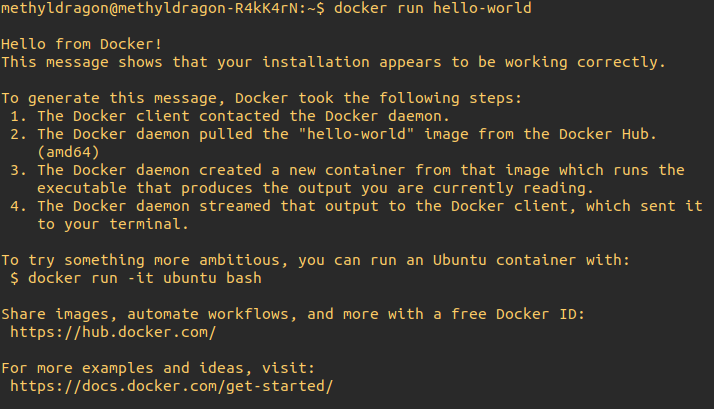
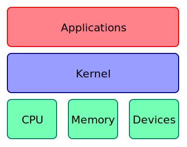
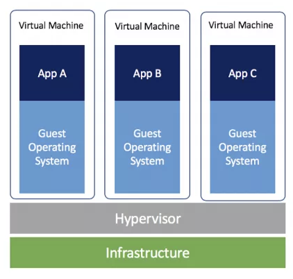
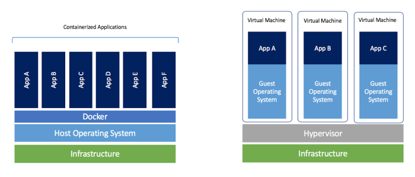
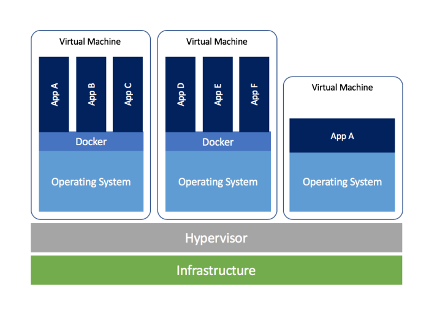
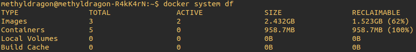
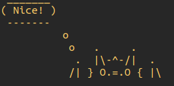

# Docker Crash Course

Author: methylDragon  
Contains a syntax reference and code snippets for Docker!  
Lots of personal notes and stuff compiled from all over the internet!    

------

## Pre-Requisites

### Required

- Linux terminal fluency
- This tutorial will be written and tested in Ubuntu 18.04, so generalisations are not guaranteed


## Table Of Contents <a name="top"></a>

1. [Introduction](#1)    
2. [Docker Setup](#2)    
   2.1 [Install via Convenience Script](#2.1)    
   2.2 [Install via Repository](#2.2)    
   2.3 [Post-Installation Steps](#2.3)    
   2.4 [Install Verification](#2.4)    
   2.5 [Uninstallation](#2.5)    
3. [Docker Basics](#3)    
   3.1 [What is Docker?](#3.1)    
   3.2 [The Docker Command](#3.2)    
   3.3 [Images and the Docker Hub](#3.3)    
   3.4 [Image Commands](#3.4)    
   3.5 [Docker System Commands](#3.5)    
   3.6 [Running Containers](#3.6)    
   3.7 [Volumes](#3.7)    
   3.8 [Basic Container Operations](#3.8)    
   3.9 [Executing Commands](#3.9)    
   3.10 [Committing and Pushing Images](#3.10)    
4. [Dockerfiles](#4)    
   4.1 [Introduction](#4.1)    
   4.2 [Building Dockerfiles](#4.2)    
   4.3 [Build Context](#4.3)    
   4.4 [Dockerignore](#4.4)    
   4.5 [Image Layers](#4.5)    
   4.6 [Dockerfile Comments](#4.6)    
   4.7 [Dockerfile Command Overview](#4.7)    
   4.8 [Shell vs Exec Form](#4.8)    
   4.9 [An Example Dockerfile](#4.9)    
   4.10 [The Proper Way to Layer](#4.10)    
   4.11 [Nifty Multi-Stage Build Tricks](#4.11)    


## 1. Introduction <a name="1"></a>


> Docker is an open platform for developing, shipping, and running applications. Docker enables you to separate your applications from your infrastructure so you can deliver software quickly. With Docker, you can manage your infrastructure in the same ways you manage your applications. By taking advantage of Docker’s methodologies for shipping, testing, and deploying code quickly, you can significantly reduce the delay between writing code and running it in production.
>
> <https://docs.docker.com/engine/docker-overview/>

Ever had to spend hours upon hours setting up an environment for a project, only to have to suddenly switch to a project and find out that your environments are clashing?

Ever wish that there were a much more isolated way of **containing** your environments so that you can send it over to someone else's computer and have your project work very nicely just by running those containers? **Well Docker lets you do that**!

> **Note**: This tutorial will presume that you are following along on a Linux system (preferably Ubuntu), and does not guarantee generalisability across other platforms (though most of the things should apply).
>
> **Additionally**: Some of the steps and ways of doing things in Docker mentioned in this tutorial are geared towards developers doing active development. There might be security concerns if one were to do things the same way in production environments, and I will try to call them out as often as possible when they become relevant, but you should be aware of the presence of these caveats.
>
> **Finally**: We will be using **Docker CE**, the community edition, not the Enterprise edition.

This tutorial aims to give you a working knowledge of Docker, and not an all-encompassing one.


## 2. Docker Setup <a name="2"></a>

[Source](<https://docs.docker.com/install/linux/docker-ce/ubuntu/#install-using-the-convenience-script>)

There's a couple of ways to install Docker, but most of the recommended ways have you taking the distribution from the Docker repo directly, not from the Ubuntu repos.


### 2.1 Install via Convenience Script <a name="2.1"></a>
[go to top](#top)


> **Some Warnings**
>
> - Using these scripts is not recommended for production environments
> - Ensure you check the scripts first before running them, especially since they use `root` or `sudo` privileges to run
> - **If you've installed Docker before, do not use the convenience script, as it can introduce problems** (eg. from having duplicate repository sources.)

```shell
# Download the script, run it, then delete the script
curl -fsSL https://get.docker.com -o get-docker.sh
sudo sh get-docker.sh
rm get-docker.sh
```

After you've installed Docker CE using the convenience script, **do not run the convenience script again, even if you want to update Docker**. Instead, you may use the package manager to update Docker.

```shell
sudo apt-get install docker-ce docker-ce-cli containerd.io
```


### 2.2 Install via Repository <a name="2.2"></a>
[go to top](#top)


You can also just set up your package manager to use Docker's repository, which should be more updated than the default one.

```shell
sudo apt-get update

# Install packages to allow use of repositories over HTTPS
sudo apt-get install \
    apt-transport-https \
    ca-certificates \
    curl \
    gnupg-agent \
    software-properties-common
    
# Add Docker's GPG key
curl -fsSL https://download.docker.com/linux/ubuntu/gpg | sudo apt-key add -

# Verify key
sudo apt-key fingerprint 0EBFCD88

# Add repository
sudo add-apt-repository \
   "deb [arch=amd64] https://download.docker.com/linux/ubuntu \
   $(lsb_release -cs) \
   stable"
   
# Install!
sudo apt-get update
sudo apt-get install docker-ce docker-ce-cli containerd.io
```

If you want to install a specific version of Docker, use

```shell
sudo apt-get install docker-ce=<VERSION_STRING> docker-ce-cli=<VERSION_STRING> containerd.io
```


### 2.3 Post-Installation Steps <a name="2.3"></a>
[go to top](#top)


[Source](<https://docs.docker.com/install/linux/linux-postinstall/>)

Now, because Docker binds to a UNIX socket in order to work, it requires `sudo` privileges to run, which causes the Docker daemon to run as the `root` user.

Here, we'll look through some steps to create a user group with sudo privileges so we can avoid having to constantly call `sudo` with Docker.

> **Note**: This can lead to security issues, especially if you have a user group that grants default `sudo` privileges to Docker!
>
> The issues are listed [here](<https://docs.docker.com/engine/security/security/#docker-daemon-attack-surface>).
>
> But it boils down to:
>
> - **Only trusted users should be allowed to control your Docker daemon**
>   - This is because Docker allows you to share directories between the host, **without limiting the rights of the container**.
>   - You should use permission checks or secure API endpoints if using Docker with an internet facing server.

With those warnings out of the way, let's go!

```shell
sudo groupadd docker # Create docker group
sudo usermod -aG docker $USER # Add yourself to the group

# Then either run this (on Linux), or log in and out again to have the changes apply!
newgrp docker
```

You can verify if you're part of the group by using

```shell
# groups
groups

# Or id, either should work
id -nG
```


**You will also want to configure Docker to start on boot!**

```shell
sudo systemctl enable docker
```

If you don't want this, disable it instead

```shell
sudo systemctl disable docker
```


### 2.4 Install Verification <a name="2.4"></a>
[go to top](#top)


Assuming you did the post installation step, you should then be able to run the Docker hello world.



```shell
docker run hello-world
```

Or if you had issues with the post-install steps, then at least

```shell
sudo docker run hello-world
```


### 2.5 Uninstallation <a name="2.5"></a>
[go to top](#top)


This is just in case you want to uninstall!

```shell
sudo apt-get purge docker-ce
sudo rm -rf /var/lib/docker # And remove any Docker images
```


## 3. Docker Basics <a name="3"></a>

### 3.1 What is Docker? <a name="3.1"></a>
[go to top](#top)


To first be able to explain what Docker is, we need to understand what a kernel is.

#### **OS Kernels**



[Image Source](<https://en.wikipedia.org/wiki/Kernel_(operating_system)>)

A kernel connects the application layer of a computer to the hardware of a computer.

Some functions of an OS kernel are:

- Schedule programs and threads
- Manage memory
- Handle hardware

#### **Virtual Machines**

So when we normally think of the types of things that we'd like Docker to do (simulate and attempt to isolate OS environments), the first thing that pops to mind is complete machine and OS simulation. That is, we'd think of virtual machines.



[Image Source](<https://blog.docker.com/2018/08/containers-replacing-virtual-machines/>)

Virtual machines will simulate their own OSes, **all the way down to the kernel level**, in order to run their applications. This added layer of simulation presents a significant overhead because the use of a [hypervisor](<https://en.wikipedia.org/wiki/Hypervisor>) and having to simulate the entire OS.

This means that virtual machines can get quite **slow** and **use a lot of memory**. The benefit, however, is that you can host multiple operating systems with differing kernels. (So, running Windows alongside a Linux distribution becomes possible.)

#### **Containers**

Containers are different though!


[Image Source](<https://blog.docker.com/2017/08/docker-101-introduction-docker-webinar-recap/>)

So the cool thing about Docker is that it **runs in the application space**, and leverages a common kernel across all containers. So all taskings actually run on the host system! **This removes the overhead associated with simulating an OS**, because you only have to double up on all the OS specific applications!

Of course, the downside to this is that **you're quite gimped if you need to simulate an OS that requires a different kernel than the kernel on your host system**. So you can't realistically run a Windows container on a Linux system. And cross-architecture stuff will be hard without a proper emulator (like the one the Docker folks are making for [ARM](<https://engineering.docker.com/2019/06/getting-started-with-docker-for-arm-on-linux/>).)

There are also issues with security, since each container shares the kernel and have root access. So the lack of isolation means you need to tighten up your security in all other aspects of your system. Docker does have some security features that try to help with isolation, but you should be aware of its limitations.

#### **Sum Up**



[Image Source](<https://blog.docker.com/2018/08/containers-replacing-virtual-machines/>)

So at the **cost of security, and some cross-OS functionality**, containers offer **speed, a lower memory footprint, and faster development time**.

And besides, if you ever find yourself needing multiple OSes, **why not combine the two solutions**?



[Image Source](<https://blog.docker.com/2018/08/containers-replacing-virtual-machines/>)


### 3.2 The Docker Command <a name="3.2"></a>
[go to top](#top)


To see all available subcommands, simply type

```shell
docker
```

This should give you a whole list of commands, and it can get quite lengthy. So in order to see what each command does, you may also use

```shell
docker <SUB_COMMAND> --help
```

**Then in order to run the commands, the signature is**

```shell
docker <SUB_COMMAND> <OPTIONS> <ARGUMENTS>
```


### 3.3 Images and the Docker Hub <a name="3.3"></a>
[go to top](#top)


Everything in Docker relies on **images**. In fact, you can think of images as snapshots of Docker containers, and containers as instances of images.


[Image Source](<https://linoxide.com/linux-how-to/dockerfile-create-docker-container/>)

More importantly, **images can be layered on top of one another** to produce a resulting container that you can then go ahead and interact with. This saves space, and simplifies the development of new images!

You can download `dockerfiles` from the [Docker Hub](<https://hub.docker.com/>), which are files that Docker can use to create images. The Hub lists dockerfiles that can be used to produce images of all sorts of different OSes, distributions, and environments!

There's dockerfiles for ROS, machine learning, web development, and a whole host of other environments out there for you to explore!


### 3.4 Image Commands <a name="3.4"></a>
[go to top](#top)


Here are some common commands you can use with images

**Search**

```shell
docker search <image_name>
```

**Get**

```shell
docker pull <image_name>
docker pull <image_name>:<tag_name>
```

**Remove Images**

```shell
docker rmi <image_name>
```

**See All Images in System**

```shell
docker images
```


### 3.5 Docker System Commands <a name="3.5"></a>
[go to top](#top)


```shell
docker system info # Get info
docker system df # Show disk usage

docker prune -a # Delete all unused images
docker prune -a --volumes # Delete all unused images, volumes included
```

> **A note on docker system df**
>
> 
>
> You might have noticed that there is a column called **RECLAIMABLE** space when using the `docker system df` command. This is simply space that is consumed by "unused images", that is, images with no containers based off of them running. (It's the size of images you can remove without breaking anything.)


### 3.6 Running Containers <a name="3.6"></a>
[go to top](#top)


[Reference](<https://docs.docker.com/engine/reference/run/>)

> **Note**: When you run a container, you are in fact instantiating a **new** container from the image you are running it from. Every run command creates a new container, which will take up space on your hard drive.
>
> If you instead wanted to execute commands inside a pre-existing, running container, use the `docker exec` command instead.

**Basic Run**

This command should drop you into a handy terminal inside the container from the get-go.

```shell
docker run -it <image_name>
```

**Useful Flags**

Non-exhaustive list

| Flag                                    | Description                                                  |
| --------------------------------------- | ------------------------------------------------------------ |
| `-e=""`                                 | Set environment variables. (Eg. `-e DISPLAY=$DISPLAY`)       |
| `--entrypoint=""`                       | Specify a command that will always be executed when the container starts. |
| `--name=NAME`                           | Specify name for container                                   |
| `--net=NETWORK` or `--network=NETWORK`  | `NETWORK` can be: bridge, none, host, network-name, network-id |
| `--rm`                                  | Delete the container once the daemon or container exits      |
| `-u <uid_or_username>`                  | Set default user to run. (Note that this does not confer root privileges unless you grant them.) (A good note is to use `$(id -u)` to use the host's user ID.) |
| `-v host_directory:container_directory` | Mount volumes/file directories inside the container. In this way, any changes made to the host directory will be reflected inside the container. |
| `-w="WORKDIR"`                          | Set default working directory for container                  |

> **Note**: You may come across the `docker create` command.
>
> All you need to know is that
>
> `docker run` = `docker create` + `docker start` + `docker attach`
>
> Which causes the container to be created, started, and then run in the foreground.


### 3.7 Volumes <a name="3.7"></a>
[go to top](#top)


[Reference](<https://docs.docker.com/storage/volumes/>)


[Image Source](<https://docs.docker.com/storage/volumes/>)

Not only can containers mount volumes from your host system, but you can also create volumes for use with containers, and share volumes amongst containers too!


#### **Container Volumes**

Of course, you can only easily mount the volumes at container creation.

```shell
docker run -it -v /volume_dir <template_image>
```

So now a volume named `volume_dir` should be visible from the root. This will persist on your host filesystem!

If you want to see where in your filesystem the volume is stored, use `docker inspect`, which should net you a couple of mount data.

```shell
docker inspect <container_name>
```

> **Note**: Using `docker rm` to delete a container will not delete its volumes unless you pass the `-v` flag.
>
> `docker rm -v <container_name>`


#### **Mounting Volumes from Other Containers**

**You can also mount volumes from other containers!** You might like to create containers which store volumes only!

To mount volumes from another container, use

```shell
docker run -it --volumes-from <src_container_name> <template_image>
```


#### **Standalone Volumes**

You can also create standalone volumes.

```shell
docker volume create <vol_name>
docker volume ls # List volumes
docker volume rm <vol_name> # Delete volumes
```

Once you do that you can mount volumes to specific directories within your containers, and then these can be shared appropriately.

```shell
docker run -it -v <vol_name>:/mount_dir <template_image>
```

You can do cool stuff like specifying volumes as read-only, and other cool stuff too! Just check out [the docs](<https://docs.docker.com/storage/volumes>).


### 3.8 Basic Container Operations <a name="3.8"></a>
[go to top](#top)


Once you've created a container with the `docker run` command, we can then use some commands to mess around with our containers!

```shell
# Start and stop container
docker start <container_name>
docker stop <container_name>

# Copy data from container to host
docker cp <container:src_path> <dest_path>

# Copy data from host to container
docker cp <src_path> <container:dest_path>

# Delete container
docker rm <container_name>

# List all running containers
docker ps -a # Show all container statuses
docker ps -as # Show all container statuses, with size
docker ps -l # Show last container created
```

> **A note on virtual size**
>
> The virtual size of an image or container is the total on-disk size of all images it is composed of. But as images can be built on each other, and track diffs, your actual disk usage can be a lot smaller if you have many containers based off of the same image.
>
> > For example, if you have two images, `app-1` and `app-2`, and both are based on a common `distro` image/layer whose total size is 100MB, and `app-1` adds an additional 10MB but `app-2`adds an additional 20MB, the virtual sizes will be 110MB and 120MB respectively, but the total disk usage will only be 130MB since that base layer is shared between the two.
> >
> > [Source](<https://stackoverflow.com/questions/32718090/what-does-virtual-size-of-docker-image-mean>)


### 3.9 Executing Commands <a name="3.9"></a>
[go to top](#top)


Once you have a container up and running, you may execute commands in the container!

```shell
# Run command in container
docker exec <container_name> <command>

# Start a shell in the container
docker exec -it <container_name> bash

# Start a shell in the container with environment variables set
docker exec -it -e VAR=VALUE <container_name> bash
```


### 3.10 Committing and Pushing Images <a name="3.10"></a>
[go to top](#top)


If you know `git` you should find the terms `commit`, `push`, and `pull` familiar. :thinking:

So if you recall, there's the Docker Hub where images can be pulled from into your machine for you to build containers off of.

**Commit**

Once you've created your own containers and modified it, you too can also create a new image on your system by **committing** it, so that you are able to make new containers based off of that committed image.

> **Note**: Committing images will not save volumes!

```shell
# Stop the container first
docker stop <container_id>

# Commit image locally
docker commit -m "Commit message" -a "Author name" <container_id>

# Commit image locally, but tied to a repository
docker commit -m "Commit message" -a "Author name" <container_id> <repo_id>/<tag>
```

The committed image should then show up in your list of images.

```shell
docker images
```

**Push**

Once you've committed an image, you may then **push** it to the Docker Hub!

> **Note**: Committing and pushing an image in this way creates a tar file that will be uploaded to the Docker Hub, which is not a recommended way of pushing images to the Docker Hub. The recommended way is using `dockerfiles`, which requires a bit more planning and foresight, and will be talked about in a separate section.

First we need to log in to the Docker Hub

```shell
docker login -u <username>
```

Then we can push our committed image appropriately! (repo_id is usually your username.)

```shell
docker push <repo_id>/<tag>
```

Once pushed, you should be able to pull on another computer

```shell
docker pull <repo_id>/<tag>
```

Nifty!


## 4. Dockerfiles <a name="4"></a>

### 4.1 Introduction <a name="4.1"></a>
[go to top](#top)


You can build new images off of Dockerfiles instead of `.tar` files! A Dockerfile simply tells Docker how to build an image. They're always named `Dockerfile`, with no extension.

Here's an example of the Dockerfile that was used to build the hello-world image!

```docker
FROM scratch
COPY hello /
CMD ["/hello"]
```

We can see that hello-world was build off of the `scratch` image (which is supposed to be explicitly empty image, and does not create a new image layer, actually. It's also a pun!)

Then it copies the `hello` directory from the `scratch` image into your new image's `/` directory. And finally it runs the `/hello` program.

> **Note**: Dockerfiles are run from top to bottom, and might result in a multi-layered image

It should be fairly obvious that this is an **exceedingly powerful tool**! We can essentially reduce entire systems and environments to a couple of setup lines, and have Docker pull the necessary images or run the necessary setup steps to build containers!


### 4.2 Building Dockerfiles <a name="4.2"></a>
[go to top](#top)


The command to use to build an image from a Dockerfile is quite simple.

```shell
# Where the current directory is the directory in which the Dockerfile resides
docker build .

# Or if it isn't there...
docker build -f path/to/Dockerfile .

# Specify repository and tag to build image to
docker build -t <repo>:<tag> .
docker build -t <repo_1>:<tag_1> -t <repo_2>:<tag_2> . # Multiple works too!
```


### 4.3 Build Context <a name="4.3"></a>
[go to top](#top)


So actually there's a bit more subtlety in the `docker build` command.

What actually happens when you run the command, is that **two** things actually get sent to the Docker daemon to build your image.

1. Your Dockerfile
2. A build context
   - This is the directory (and all subdirectories) specified in the build command.
   - `docker build <build_context_directory>` or `docker build -f dockerfile_path <build_context_directory>`

The build context is important because any file you want to `ADD` or `COPY` into your container has to be included in the build context, which is uploaded to the Docker daemon.

It's also important to ensure that no sensitive information is stored in the build context in case you accidentally send them into your container. You can exclude files from inclusion into the build context using **dockerignore** files.

And if anything, it helps with the speed of the build if you can shrink the size of the build context so less stuff has to be transferred to the Docker daemon before it can actually start building your image.


### 4.4 Dockerignore <a name="4.4"></a>
[go to top](#top)


You can create a `.dockerignore` file in the root directory of your build context. The exclusion pattern is the same as [.gitignore files](<https://www.atlassian.com/git/tutorials/saving-changes/gitignore>), and will ignore files in the build context, and any files added using the `ADD` or `COPY` commands, if it matches the pattern.

This is a handy tool to help you prevent accidentally sending credentials or passwords into your containers!


### 4.5 Image Layers <a name="4.5"></a>
[go to top](#top)


So if you remember from the introduction to Docker, images are made of layers.


But what actually happens during the building of an image, is each successive layer is built in its own intermediate container to produce a read-only layer, and then successive layers are built and stacked on top of each other until you have your final image with a writable container layer on top.


[Image Source](<https://docs.docker.com/storage/storagedriver/>)

With Dockerfiles, you have extra control over this process! Because you can use Dockerfile commands to specify when new layers should begin. And this allows you to do cool stuff like utilising the build cache to speed up your builds. But let's take things slow first.


### 4.6 Dockerfile Comments <a name="4.6"></a>
[go to top](#top)


Comments are specified with `#`

```dockerfile
# Like so!
```


### 4.7 Dockerfile Command Overview <a name="4.7"></a>
[go to top](#top)


[Reference](<https://docs.docker.com/engine/reference/builder/>)

[Cheatsheet](<https://kapeli.com/cheat_sheets/Dockerfile.docset/Contents/Resources/Documents/index>)

All Dockerfile commands are written in full uppercase form.

The list is non-exhaustive.

|    Command    |                         Description                          | Makes new Layer |
| :-----------: | :----------------------------------------------------------: | :-------------: |
|    `FROM`     | Specifies a parent image (you can specify multiple parent images! They'll just form multiple layers.) |        *        |
| `MAINTAINER`  |               (Depreciated) Specify maintainer               |                 |
|    `LABEL`    |                  Metadata in key=value form                  |                 |
|     `ENV`     |                   Set environment variable                   |                 |
|     `RUN`     |   Run command, and create image layer (triggers on build)    |        *        |
|    `COPY`     |           Copy files and directories to container            |        *        |
|     `ADD`     |     Like `COPY`, but can untar and download online files     |        *        |
|     `CMD`     | Specify the default command that is run when the built image is launched (only one can exist) |                 |
|   `WORKDIR`   |    Specify working directory for instructions that follow    |                 |
|     `ARG`     |                     Build-time variable                      |                 |
| `ENTRYPOINT`  | Specifies default command that is run when the built image is launched (but this is **not ignored** when the Docker container runs with command line parameters.) (Use this is the container is meant to be used like an executable.) |                 |
|   `EXPOSE`    |                        Expose a port                         |                 |
|   `VOLUME`    |                        Mount a volume                        |                 |
|   `ONBUILD`   | Specify a Dockerfile command that is executed when the image specified by this Dockerfile is used as a base for another build. (Triggered immediately after the `FROM` instruction.) |                 |
| `STOPSIGNAL`  | Specify the system call that is sent to the container to exit. |                 |
| `HEALTHCHECK` | Specify a command to check if a container is healthy. You can set number of retires, check interval, and check timeout. |                 |
|    `SHELL`    | Change the default shell that is used to run the `RUN`, `CMD`, and `ENTRYPOINT` commands. |                 |


### 4.8 Shell vs Exec Form <a name="4.8"></a>
[go to top](#top)


There are multiple ways to specify how Docker should run a command with the `RUN` and `CMD` commands. Namely the **shell** and **exec** forms.

- shell: `RUN <command>`
- exec: `["executable", "param_1", "param_2", ...]`

The shell form is run in a shell (`/bin/sh -c` on Linux, and `cmd /S /C` on Windows.)

**Important Differences**

- The exec form is **preferred**
- The exec form **requires words to be enclosed by double quotes only** (as it is parsed as a JSON array)
- The exec form does not invoke a command shell, so variable substitution does not happen
  - If you wanted it to happen, use either the shell form, or use something like `RUN ["sh", "-c", "echo $HOME"]`


### 4.9 An Example Dockerfile <a name="4.9"></a>
[go to top](#top)


Let's build a Dockerfile, shall we? Let's do one that'll let you print dragons :eyes:

Remember again that `FROM`, `RUN`, `ADD`, and `COPY` will create new layers.

> **Note**: Due to caching issues, if you need to run apt-get update, always do it in the same command as the apt-get install.

```dockerfile
# Layer 1
FROM ubuntu

# Layer 2, install deps
RUN apt-get update && apt-get install -y \
	cowsay \
	fortune

# Since cowsay installs to /usr/games
ENV PATH $PATH:/usr/games
WORKDIR /usr/share/cowsay/cows

# Layer 3 and 4, download methylDragon ASCII and put them in the working directory
ADD https://raw.githubusercontent.com/methylDragon/fun-stuff/master/cowsay/methylDragon/methyldragon.cow .
ADD https://raw.githubusercontent.com/methylDragon/fun-stuff/master/cowsay/methylDragon/methylhalf.cow .

# Layer 5 and 6, add aliases
RUN echo 'alias methyl="fortune | cowsay -f methyldragon"' >> ~/.bashrc
RUN echo 'alias methylhalf="fortune | cowthink -f methylhalf"' >> ~/.bashrc

# Reset the working directory
WORKDIR /
CMD fortune | cowsay -f methyldragon && bash
```



We'll build and run some commands!

```shell
# Build the image
docker build -t methyldragon/methylsay .
```

And spin up the container!

```shell
# Then we can spin up a container and see what it does
# It should start with a fortune from me to begin with, and drop you into a terminal
# No worries about deleting the container, since it deletes itself on exit
docker run -it --rm methyldragon/methylsay

# And now that we're inside the container, we can try some commands!
methyl # Get a fortune with the full methyl
methylhalf # Get a random fortune with the half methyl

methyl Rawr
methylhalf Nice!
```


### 4.10 The Proper Way to Layer <a name="4.10"></a>
[go to top](#top)


If you actually rebuilt the Dockerfile again with some changes nearing the end of the file, you'll notice that it will build waaaaay faster than the initial build.

This is because, again, images are layered on top of each other, and Docker will only rebuild images starting from the layer with a change in it, all the way to the outermost image.

**As such, it is a best practice to order your Dockerfile from less frequently changed to more frequently changed**.

A good order suggested by the Docker docs is, starting from the top:

> 1. Install tools you need to build your application
> 2. Install or update library dependencies
> 3. Generate your application


### 4.11 Nifty Multi-Stage Build Tricks <a name="4.11"></a>
[go to top](#top)


So with each `FROM`  command you can actually specify a name for the build stage.

```dockerfile
FROM scratch AS stage_name_1
FROM ubuntu AS stage_name_2
```

This means that you can start copying from the previous built images by name

```shell
COPY --from=stage_name /src_dir /dest_dir
```

And you can also **stop building at a particular build stage** using the `--target` argument

```shell
docker build --target stage_name_1 .
```


```
                            .     .
                         .  |\-^-/|  .    
                        /| } O.=.O { |\
```

​    

------

 [.png)](https://www.buymeacoffee.com/methylDragon)

